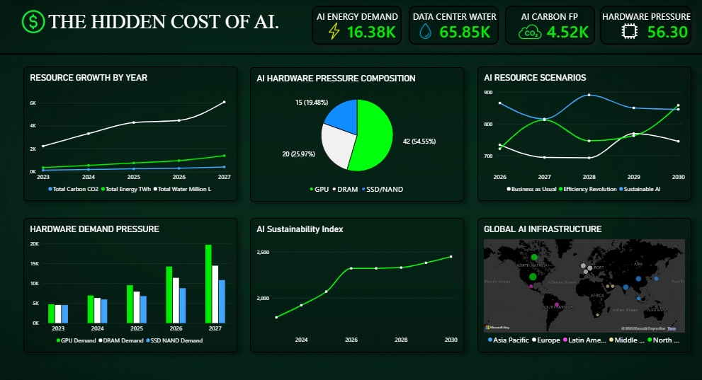

# 🤖 AI: The Rise, The Race & The Reckoning

> **Interactive Microsoft Power BI project analyzing the growth of major AI ecosystems and the hidden infrastructure, energy, water, carbon and hardware pressures behind AI.**

[](https://powerbi.microsoft.com/)
[](#)
[](#)
[](#)
[](#)

---

## 📌 Project Overview

**AI: The Rise, The Race & The Reckoning** is a two-dashboard Power BI project that connects the rapid growth of artificial intelligence with the physical infrastructure required to support it.

The project is divided into two analytical views:

1. **The AI Revolution** — compares ChatGPT, Gemini, Claude and DeepSeek using model, performance, pricing, training-cost and infrastructure-related indicators.
2. **The Hidden Cost of AI** — explores energy demand, data-center water, carbon footprint, hardware pressure, resource growth, sustainability and future resource scenarios.

The project is designed to answer a simple question:

> **As AI becomes more capable and widely adopted, what infrastructure and resources are required to support that growth?**

---

# 🎯 Project Objectives

- Compare major AI ecosystems and model families.
- Track model performance and capability indicators.
- Analyse AI pricing and training-cost indicators.
- Understand dominant AI use cases.
- Visualize global data-center locations and infrastructure.
- Examine energy, water and carbon-related indicators.
- Analyse pressure on GPU, HBM, DRAM and SSD/NAND.
- Compare future AI resource scenarios.
- Present complex AI trends through an interactive Power BI story.

---

# 📊 Dashboard Preview

## 1️⃣ The AI Revolution

The first dashboard focuses on the **AI race** between major ecosystems.

### Key visuals

- Benchmark Score card
- Success Rate card
- Speed Latency card
- Training Cost card
- Model Performance Trends
- Input vs. Output Price per 1M Tokens
- Dominant Use Case Composition
- Global Data Center Locations
- AI ecosystem/model selection

### Featured ecosystems

- ChatGPT / OpenAI
- Gemini / Google
- Claude / Anthropic
- DeepSeek


---

## 2️⃣ The Hidden Cost of AI

The second dashboard focuses on the **physical and sustainability dimensions of AI growth**.

### Key visuals

- AI Energy Demand card
- Data Center Water card
- AI Carbon Footprint card
- Hardware Pressure card
- Resource Growth by Year
- AI Hardware Pressure Composition
- AI Resource Scenarios
- Hardware Demand Pressure
- AI Sustainability Index
- Global AI Infrastructure map



---

# 🔎 Dashboard 1 — The AI Revolution

### Business Questions

- How do major AI ecosystems compare?
- How are model capability and performance changing?
- What are the differences between input and output token prices?
- Which AI use cases dominate the represented dataset?
- What training-cost indicators are associated with different AI models?
- Where is the represented data-center infrastructure located?

### Key Analytical Areas

| Analysis | Purpose |
|---|---|
| Benchmark Score | Compare represented model performance |
| Success Rate | Compare represented task success |
| Speed Latency | Examine response-speed indicators |
| Training Cost | Compare training-cost indicators |
| Performance Trends | Track capability, context and speed measures |
| Token Pricing | Compare input and output prices |
| Use Cases | Understand dominant AI application areas |
| Data Centers | Visualize global infrastructure locations |

---

# 🌱 Dashboard 2 — The Hidden Cost of AI

### Business Questions

- How are energy, water and carbon indicators changing over time?
- Which hardware components show the greatest modeled demand pressure?
- How is hardware pressure distributed across GPU, HBM, DRAM and SSD/NAND?
- Where is AI infrastructure geographically concentrated?
- How do resource outcomes differ across future scenarios?
- How does the sustainability indicator change over time?

### Key Analytical Areas

| Analysis | Purpose |
|---|---|
| Energy Demand | Track AI-related infrastructure energy |
| Water Demand | Track data-center water indicators |
| Carbon Footprint | Track carbon-emission indicators |
| Hardware Pressure | Monitor pressure across key hardware |
| Resource Growth | Compare energy, water and carbon trends |
| Hardware Composition | Show modeled hardware pressure shares |
| Resource Scenarios | Compare alternative future pathways |
| Global Infrastructure | Visualize infrastructure concentration |
| Sustainability Index | Track the project-defined sustainability indicator |

---

# 🔄 Project Workflow

```text
                    DATASETS
                       │
                       ▼
              DATA PREPARATION
                       │
                       ▼
              DATA TRANSFORMATION
                       │
                       ▼
               POWER BI MODEL
                       │
                       ▼
              DAX / CALCULATIONS
                       │
             ┌─────────┴─────────┐
             ▼                   ▼
      THE AI REVOLUTION    THE HIDDEN COST
             │                   │
             └─────────┬─────────┘
                       ▼
                INTERACTIVE
                 DASHBOARDS
                       │
                       ▼
                 AI INSIGHTS
```

---

# 🧮 Data & Analysis

The repository contains project datasets covering AI model, performance, pricing, infrastructure, hardware and sustainability-related indicators.

Main dataset files include:

```text
Dataset/
├── AI_COST Dataset.xlsx
├── AI_Dashboard_Dataset.xlsx
├── Hardware Pressure.xlsx
└── Infrastructure_DataCenters.xlsx
```

The exact formulas and assumptions used in the final Power BI implementation should be documented alongside the PBIX file.

---

# 💡 Key Insights

- AI adoption and model capabilities are rapidly expanding.
- More capable AI requires greater computing and infrastructure resources.
- AI infrastructure depends on specialized hardware such as GPUs and memory.
- Energy, water and carbon indicators provide a view of AI's physical footprint.
- Data-center infrastructure is geographically concentrated.
- Future efficiency and sustainability pathways can change resource requirements.

---

# 💼 Use Cases

### Government & Policy
Plan AI, energy and digital infrastructure.

### Technology Companies
Improve computing, hardware and resource efficiency.

### Investors & Businesses
Understand AI growth and infrastructure requirements.

### Researchers
Study relationships between AI capability, infrastructure and resource demand.

### Sustainability Teams
Monitor resource pressure and support efficient infrastructure planning.

### Students & Public
Understand both the growth of AI and the physical resources behind it.

---

# 🛠️ Technologies Used

| Technology | Purpose |
|---|---|
| **Microsoft Power BI** | Dashboard development and visualization |
| **Power Query** | Data preparation and transformation |
| **DAX** | Measures and analytical calculations |
| **Microsoft Excel** | Dataset storage and preparation |
| **Git & GitHub** | Version control and project documentation |

---

# 📁 Repository Structure

```text
AI-Rise-Race-Reckoning-PowerBI/
│
├── 📄 README.md
├── 📄 .gitignore
│
├── 📊 Dashboard/
│   ├── AI_Rise_Race_Reckoning.pbix
│   └── README.md
│
├── 📂 Dataset/
│   ├── AI_COST Dataset.xlsx
│   ├── AI_Dashboard_Dataset.xlsx
│   ├── Hardware Pressure.xlsx
│   ├── Infrastructure_DataCenters.xlsx
│   └── README.md
│
├── 🖼️ Screenshots/
│   ├── ai-revolution-dashboard.png
│   └── hidden-cost-dashboard.png
│
├── 📚 Documentation/
│   ├── Project_Overview.md
│   ├── Data_Dictionary.md
│   ├── DAX_Measures.md
│   └── Methodology.md
│
└── 📑 Reports/
    └── AI_Rise_Race_Reckoning_Project_Report.md
```

---

# ⚠️ Limitations & Interpretation

- Dashboard values should be interpreted according to the definitions and assumptions of the project datasets.
- Project-defined indices should not be treated as official industry benchmarks.
- Resource and sustainability indicators should be clearly distinguished from directly measured AI-specific impacts.
- Historical values, estimates and scenario values should be identified separately where applicable.
- The dashboard is an analytical and educational project, not an official report from OpenAI, Google, Anthropic, DeepSeek or any other AI company.

---

# 🚀 Future Enhancements

- Add more AI ecosystems and model families.
- Add automated dataset refresh.
- Add model-level drill-through pages.
- Add year-over-year growth measures.
- Add scenario controls for energy, water and carbon.
- Add more detailed infrastructure and hardware datasets.
- Add forecasting for AI resource demand.
- Add a dedicated methodology and source-validation page.

---

# 📜 Disclaimer

This project is an **educational and portfolio-oriented Business Intelligence project** created for data analysis, visualization and dashboard demonstration.

It is **not an official publication, financial report, environmental report or corporate report** of OpenAI, Google, Anthropic, DeepSeek or any other organization.

Company, product and model names are used only for analytical comparison and identification.

---

# ⭐ Project Category

**Business Intelligence | Data Analytics | Power BI | AI Analytics | Data Visualization | Sustainability**

### Core Skills

```text
Data Preparation
      ↓
Data Transformation
      ↓
Power BI Data Modeling
      ↓
DAX Calculations
      ↓
Interactive Dashboard Design
      ↓
AI Model Analysis
      ↓
Infrastructure Analysis
      ↓
Sustainability Analysis
      ↓
Data Storytelling
```

---

## ⭐ If you found this project useful

Feel free to explore the dashboard, datasets and documentation to understand how AI growth can be analysed together with its infrastructure and resource requirements.
# The-AI-Paradox-Analysis-PowerBI
